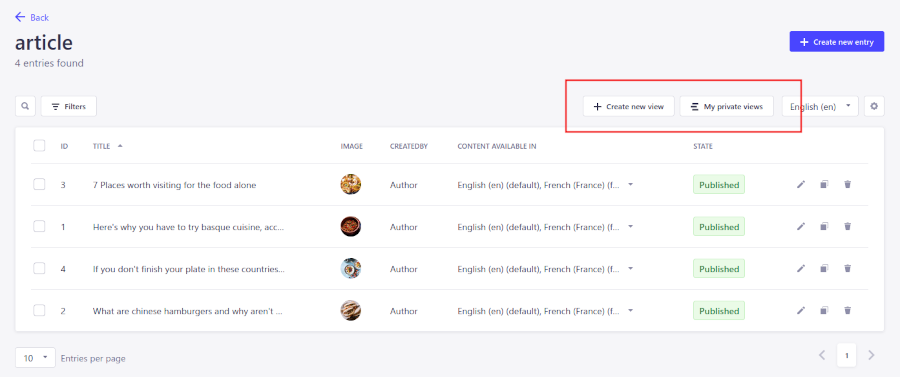

<a href="https://www.kaliop.com/"></a>

# Favorite views for Strapi

<!--

-->

This package lets you create "favorite views" to simplify access to specific searches within a defined content type.
Make your searches easier by creating links to customized views in your Strapi interface.

## Getting started

### Installation

```bash
npm install strapi-plugin-favorite-views
```

Then, enable the plugin in strapi:

```js
// config/plugins.js

module.exports = () => ({
  "favorite-views": {
    enabled: true,
  },
  // .. other plugins
});
```

## Configure

This plugin injects a widget component into the content-manager:



You can inject the widget component to any additional plugin injection zone using the `STRAPI_ADMIN_FAVORITE_VIEWS_INJECT_TO` environment variable.

The variable contains a comma separated list of zones to inject, in the following syntax:

`plugin::<plugin name>.<container>.<block>`

Example:

```
STRAPI_ADMIN_FAVORITE_VIEWS_INJECT_TO=plugin::opensearch.globalSearch.listView,plugin::another-plugin.container.block
```

## How to use

This plugin lets you create views to directly access your favorite filter selection in the content type of your choice.

Install the plugin and once you've selected your filters, click on "create new view" and you now have it on `My private view` widget.

You can also share your views with specific roles.
